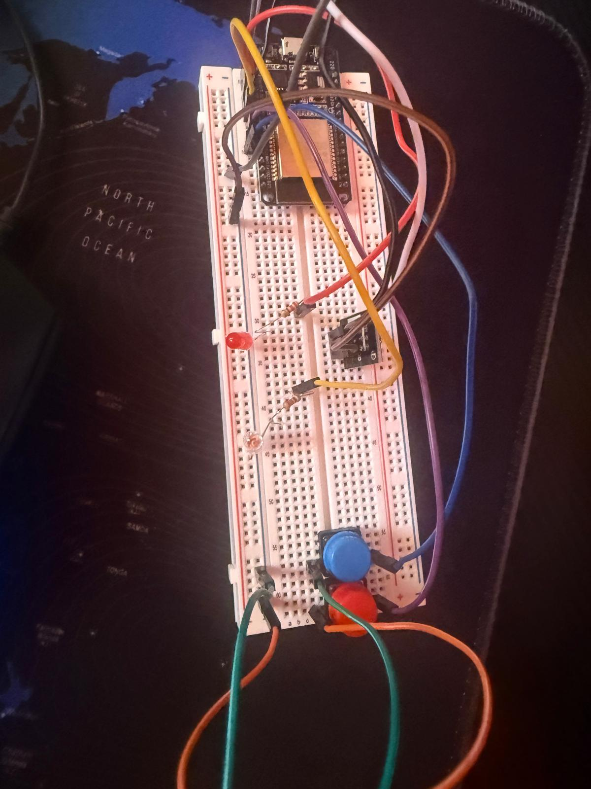

\---

layout: default

title: v1.0

\---

\# v2.0 - Multi-Button RAW TV Controller

\## Overview

An evolution centered on raw data, which overcame the interpretation limits of standard libraries by leveraging RAW timing arrays for power and channel-switching keys on dedicated pins, thereby optimizing transmission accuracy.

\---

\## Technical Scope

\* Transition from protocol-dependent parsing to raw pulse-width capture.

\* Custom pin mapping for multi-button configurations.

\* Elimination of library overhead for targeted commands.

\---

\## Architecture and Component Description

The second iteration of the project marks the crucial transition from rigid standard protocols to raw signal management, known as RAW mode. Moving beyond the limitations of commercial decoders, the system leverages the processing power of the ESP32 to capture and replicate complex timing sequences made of active microsecond pulses and pauses of the infrared LED with pinpoint accuracy. From a hardware standpoint, the architecture expands by introducing physical push buttons configured with internal pull-ups, each mapped to a specific action such as power toggling or channel switching. When a button is pressed, the microcontroller processes and streams a custom array of timing data through the emitter diode driven at a thirty-eight kilohertz carrier frequency, successfully bypassing commercial remote incompatibilities and delivering a direct, reliable control framework completely independent of traditional library presets.

&#x20; 

\---

