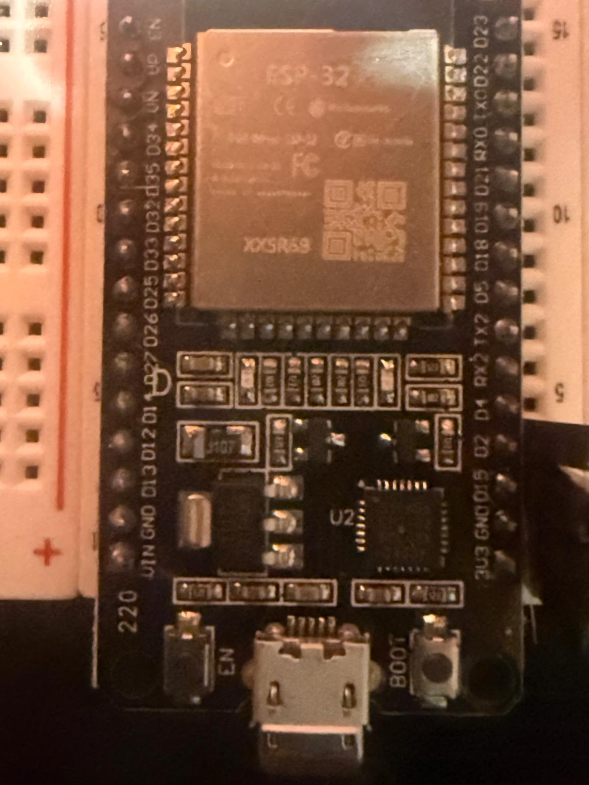

\# v3.0 - High-Payload AC (Air Conditioner) RAW Controller

\## Overview

The third version represents the culmination of this hardware journey, transforming the system into a universal controller capable of replicating any infrared device thanks to the power and flexibility of raw data.

The evolutionary leap toward this universal configuration stemmed directly from tackling the initial hurdle of air conditioning units, whose control units do not transmit single commands but rather entire state packets formed by hundreds of temporal transitions. Managing such complex and lengthy data flows required pushing the microcontroller's internal memory architecture to its limits, overcoming an initial bottleneck resolved by correctly formatting the ESP32's flash storage space to accommodate large arrays without saturating system resources.

&#x20; 

\---

\## Key Engineering Achievements

Freed from any proprietary protocol decoding constraints and backed by optimized memory management, the system has become entirely agnostic regarding brand or appliance type. It can accurately store and replay the RAW signatures of televisions, air conditioners, or any other infrared peripheral simply by capturing their energetic footprint.

\---

